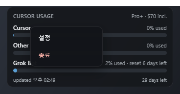
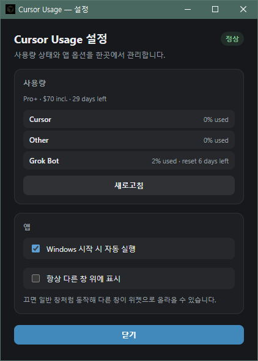

# Cursor Usage Widget

Windows 바탕화면용 플로팅 위젯입니다. Cursor **included** 사용량을 **Cursor / Other** 두 트랙으로 프로그레스바와 짧은 문구로 표시합니다.


트랙별 included 사용량, 플랜 배지, 결제 주기 갱신까지 남은 일수를 한 창에 모아 봅니다.

스펙: `docs/references/assets/20260729-cursor-usage-widget/system-spec.md`  
스파이크: `python scripts/spike_usage.py`

## 화면과 사용법

### 위젯


- **위치 이동** — 헤더·푸터·여백을 잡고 드래그하면 창이 따라옵니다. 놓은 자리는 바로 저장되어 다음 실행에도 이어집니다.
- **플랜 배지** — 헤더 오른쪽에 플랜 이름과 included 한도를 `Pro+ · $70 incl.` 형태로 적습니다.
- **트랙 읽기** — 진행바는 included 소진율입니다. 70% 이상이면 주황, 90% 이상이면 빨강으로 바뀝니다.
  - `Cursor` — Cursor 트랙 사용량
  - `Other` — 그 밖 트랙 사용량
  - `Grok Bot` — 별도 한도가 잡혀 있을 때만 나타나고, 자체 리셋까지 남은 기간을 함께 적습니다.
- **푸터** — 왼쪽은 상태(`updated 02:49` / `Cursor 로그인 필요` / `갱신 실패`), 오른쪽은 결제 주기 갱신까지 남은 일수입니다.
- **자동 갱신** — 5분마다 사용량을 다시 읽습니다.

위젯 아무 곳이나 우클릭하면 메뉴가 열립니다.



- **설정** — 설정 창을 엽니다.
- **종료** — 위젯을 끕니다.
- 메뉴 밖을 클릭하거나 `Esc` 를 누르면 그냥 닫힙니다.

### 설정 창



- **상태 배지** — 오른쪽 위에 `정상` / `로그인 필요` / `갱신 실패` 를 표시합니다.
- **사용량** — 플랜·갱신 잔여일과 트랙별 수치를 위젯과 같은 값으로 나열합니다.
  - **새로고침** — 지금 바로 사용량을 다시 읽습니다. 받아온 값은 위젯에도 같이 반영됩니다.
- **Windows 시작 시 자동 실행** — 부팅 시 위젯을 띄웁니다. 항상 `%LOCALAPPDATA%\CursorUsageWidget` 설치본 경로만 등록하므로, `target\debug` exe를 직접 켜도 시작프로그램이 깨지지 않습니다. (개발 모드에서는 끌 수 없게 잠기고 안내 문구가 뜹니다.)
- **항상 다른 창 위에 표시** — 끄면 일반 창처럼 동작해 다른 창이 위젯 위로 올라올 수 있습니다.
- **닫기** — 설정 창만 숨깁니다. 위젯은 계속 떠 있습니다. `Esc` 도 같은 동작입니다.

## 일반 사용자 (추천)

1. 프로젝트 폴더의 **`시작.bat`** 을 더블클릭하세요.
2. 처음 한 번만 릴리스 빌드·설치가 진행되고, 이후에는  
   `%LOCALAPPDATA%\CursorUsageWidget\cursor-usage-widget.exe` 가 바로 실행됩니다.
3. 바탕화면에 **Cursor Usage Widget** 바로가기도 만들어 둡니다.
4. 부팅 시 자동 실행과 항상 위에 표시는 **우클릭 → 설정** 에서 켜고 끕니다. ([설정 창](#설정-창) 참고)

`target\debug\*.exe` 를 찾아 실행하면 **개발용**이라 화면이 비어 보이거나 안내 창만 뜹니다. 사용하지 마세요.

## 개발 실행

```powershell
npm install
npm run tauri dev
```

요구 사항: Windows + Cursor 로그인, Node.js, Rust, Visual Studio C++ Build Tools, WebView2.

## 스크립트

| 명령 | 용도 |
|------|------|
| `시작.bat` / `npm run start:app` | 설치본 실행 (비개발자) |
| `npm run rebuild:app` | release 강제 재빌드·재시작 (작업 완료 후) |
| `npm run build:app` | 릴리스 빌드만 |
| `npm run tauri dev` | Vite + debug (개발) |
| `npm run spike` | usage API 스파이크 |

## 주의

- 인증은 로컬 `%APPDATA%\Cursor\User\globalStorage\state.vscdb`의 `cursorAuth/accessToken`을 읽습니다.
- Cursor 내부 API는 **비공식**이며 언제든 깨질 수 있습니다.
- On-demand UI는 범위 밖입니다.
