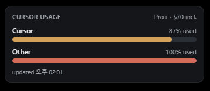

# Cursor Usage Widget

Windows 바탕화면용 플로팅 위젯. Cursor **included** 사용량을 **Cursor / Other** 두 트랙으로 프로그레스바 + 짧은 문구로 표시한다.



스펙: `docs/references/assets/20260729-cursor-usage-widget/system-spec.md`  
스파이크: `python scripts/spike_usage.py`

## 일반 사용자 (추천)

1. 프로젝트 폴더의 **`시작.bat`** 을 더블클릭한다.
2. 처음 한 번만 릴리스 빌드·설치가 진행되고, 이후에는  
   `%LOCALAPPDATA%\CursorUsageWidget\cursor-usage-widget.exe` 가 바로 실행된다.
3. 바탕화면에 **Cursor Usage Widget** 바로가기도 만들어 둔다.
4. 위젯에서 **우클릭 → 시작프로그램** 으로 부팅 시 자동 실행을 켠다.  
   (항상 위 설치 경로만 등록하므로, `target\debug` exe를 직접 켜도 시작프로그램이 깨지지 않는다.)

`target\debug\*.exe` 를 찾아 실행하면 **개발용**이라 화면이 비어 보이거나 안내 창만 뜹니다. 쓰지 마세요.

## 개발 실행

```powershell
npm install
npm run tauri dev
```

요구: Windows + Cursor 로그인, Node.js, Rust, Visual Studio C++ Build Tools, WebView2.

## 스크립트

| 명령 | 용도 |
|------|------|
| `시작.bat` / `npm run start:app` | 설치본 실행 (비개발자) |
| `npm run make:icon` | `app-icon.png` → `src-tauri/icons` (BMP ICO) |
| `npm run build:app` | 릴리스 빌드만 (아이콘은 exe에 임베드) |
| `npm run tauri dev` | Vite + debug (개발) |
| `npm run spike` | usage API 스파이크 |

아이콘을 바꿀 때: `app-icon.png` 교체 → `npm run make:icon` → `npm run build:app` → `시작.bat`.  
exe 옆에 `icon.ico`를 두는 것만으로는 Windows 탐색기 아이콘이 바뀌지 않는다.

## 주의

- 인증은 로컬 `%APPDATA%\Cursor\User\globalStorage\state.vscdb`의 `cursorAuth/accessToken`을 읽는다.
- Cursor 내부 API는 **비공식**이며 언제든 깨질 수 있다. 장애 시 [대시보드](https://cursor.com/dashboard)가 진실의 원천이다.
- 토큰을 로그·커밋·원격 전송하지 말 것.
- On-demand UI는 범위 밖이다.
